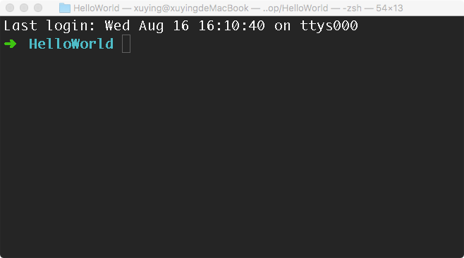

# 第1章 JavaScript语言概述

Javascript是一种解释性的，基于对象的脚本语言(an interpreted, object-based scripting language)。
HTML网页在互动性方面能力较弱，例如下拉菜单，就是用户点击某一菜单项时，自动会出现该菜单项的所有子菜单，用纯HTML网页无法实现；又如验证HTML表单(Form)提交信息的有效性，用户名不能为空，密码不能少于4位，邮政编码只能是数字之类，用纯HTML网页也无法实现。要实现这些功能，就需要用到Javascript。

## 1.1 JavaScript简史
Javascript是一种解释性的，基于对象的脚本语言(an interpreted, object-based scripting language)。
HTML网页在互动性方面能力较弱，例如下拉菜单，就是用户点击某一菜单项时，自动会出现该菜单项的所有子菜单，用纯HTML网页无法实现；又如验证HTML表单(Form)提交信息的有效性，用户名不能为空，密码不能少于4位，邮政编码只能是数字之类，用纯HTML网页也无法实现。要实现这些功能，就需要用到Javascript。

1995 年Netscape 公司和Sun 公司联合开发出JavaScript 脚本语言，并在其Netscape
Navigator 2 中实现了JavaScript 脚本规范的第一个版本即JavaScript 1.0 版，不久就显示了其强大的生机和发展潜力。由于当时Netscape Navigator 主宰着Web 浏览器市场，而Microsoft的IE 则扮演追赶者的角色，为了跟上Netscape 步伐，Microsoft 在其Internet Explorer 3 中以JScript 为名发布了一个JavaScript 的克隆版本JScript 1.0。

1997 年，为了避免无序竞争，同时解决JavaScript 几个版本语法、特性等方面的混乱，
JavaScript 1.1 作为草案提交给ECMA（欧洲计算机厂商协会），并由Netscape、Sun、Microsoft、
Borland 及其它一些对脚本语言比较感兴趣的公司组成的TC39（第39 技术委员会：以下简
称TC39）协商并推出了ECMA-262 规范版本，其定义了以JavaScript 为蓝本、全新的
ECMAScript 脚本语言。

在接下来的几年，ISO/IEC（估计标准化组织/国际电工委员会）采纳ECMAScript 作为
Web 脚本语言标准（ISO/IEC-16262）。从此，ECMAScript 作为JavaScript 脚本的基础开始得到越来越多的浏览器厂商在不同程度上支持。

## 1.2 ECMAScript 和 JavaScript 的关系
一个常见的问题是，ECMAScript 和 JavaScript 到底是什么关系？

要讲清楚这个问题，需要回顾历史。1996年11月，JavaScript 的创造者 Netscape 公司，决定将 JavaScript 提交给国际标准化组织ECMA，希望这种语言能够成为国际标准。次年，ECMA 发布262号标准文件（ECMA-262）的第一版，规定了浏览器脚本语言的标准，并将这种语言称为 ECMAScript，这个版本就是1.0版。

该标准从一开始就是针对 JavaScript 语言制定的，但是之所以不叫 JavaScript，有两个原因。一是商标，Java 是 Sun 公司的商标，根据授权协议，只有 Netscape 公司可以合法地使用 JavaScript 这个名字，且 JavaScript 本身也已经被 Netscape 公司注册为商标。二是想体现这门语言的制定者是 ECMA，不是 Netscape，这样有利于保证这门语言的开放性和中立性。

因此，ECMAScript 和 JavaScript 的关系是，前者是后者的规格，后者是前者的一种实现（另外的 ECMAScript 方言还有 Jscript 和 ActionScript）。日常场合，这两个词是可以互换的。

## 1.3 ES6 与 ECMAScript 2015 的关系
ECMAScript 2015（简称 ES2015）这个词，也是经常可以看到的。它与 ES6 是什么关系呢？

2011年，ECMAScript 5.1版发布后，就开始制定6.0版了。因此，ES6 这个词的原意，就是指 JavaScript 语言的下一个版本。

但是，因为这个版本引入的语法功能太多，而且制定过程当中，还有很多组织和个人不断提交新功能。事情很快就变得清楚了，不可能在一个版本里面包括所有将要引入的功能。常规的做法是先发布6.0版，过一段时间再发6.1版，然后是6.2版、6.3版等等。

但是，标准的制定者不想这样做。他们想让标准的升级成为常规流程：任何人在任何时候，都可以向标准委员会提交新语法的提案，然后标准委员会每个月开一次会，评估这些提案是否可以接受，需要哪些改进。如果经过多次会议以后，一个提案足够成熟了，就可以正式进入标准了。这就是说，标准的版本升级成为了一个不断滚动的流程，每个月都会有变动。

标准委员会最终决定，标准在每年的6月份正式发布一次，作为当年的正式版本。接下来的时间，就在这个版本的基础上做改动，直到下一年的6月份，草案就自然变成了新一年的版本。这样一来，就不需要以前的版本号了，只要用年份标记就可以了。

ES6 的第一个版本，就这样在2015年6月发布了，正式名称就是《ECMAScript 2015标准》（简称 ES2015）。2016年6月，小幅修订的《ECMAScript 2016标准》（简称 ES2016）如期发布，这个版本可以看作是 ES6.1 版，因为两者的差异非常小（只新增了数组实例的includes方法和指数运算符），基本上是同一个标准。根据计划，2017年6月发布 ES2017 标准。

因此，ES6 既是一个历史名词，也是一个泛指，含义是5.1版以后的 JavaScript 的下一代标准，涵盖了ES2015、ES2016、ES2017等等，而ES2015 则是正式名称，特指该年发布的正式版本的语言标准。本书中提到 ES6 的地方，一般是指 ES2015 标准，但有时也是泛指“下一代 JavaScript 语言”。

## 1.4 ECMAScript 的历史
ES6 从开始制定到最后发布，整整用了15年。

前面提到，ECMAScript 1.0 是1997年发布的，接下来的两年，连续发布了 ECMAScript 2.0（1998年6月）和 ECMAScript 3.0（1999年12月）。3.0版是一个巨大的成功，在业界得到广泛支持，成为通行标准，奠定了 JavaScript 语言的基本语法，以后的版本完全继承。直到今天，初学者一开始学习 JavaScript，其实就是在学3.0版的语法。

2000年，ECMAScript 4.0 开始酝酿。这个版本最后没有通过，但是它的大部分内容被 ES6 继承了。因此，ES6 制定的起点其实是2000年。

为什么 ES4 没有通过呢？因为这个版本太激进了，对 ES3 做了彻底升级，导致标准委员会的一些成员不愿意接受。ECMA 的第39号技术专家委员会（Technical Committee 39，简称TC39）负责制订 ECMAScript 标准，成员包括 Microsoft、Mozilla、Google 等大公司。

2007年10月，ECMAScript 4.0 版草案发布，本来预计次年8月发布正式版本。但是，各方对于是否通过这个标准，发生了严重分歧。以 Yahoo、Microsoft、Google 为首的大公司，反对 JavaScript 的大幅升级，主张小幅改动；以 JavaScript 创造者Brendan Eich为首的Mozilla公司，则坚持当前的草案。

2008年7月，由于对于下一个版本应该包括哪些功能，各方分歧太大，争论过于激烈，ECMA 开会决定，中止 ECMAScript 4.0 的开发，将其中涉及现有功能改善的一小部分，发布为 ECMAScript 3.1，而将其他激进的设想扩大范围，放入以后的版本，由于会议的气氛，该版本的项目代号起名为 Harmony（和谐）。会后不久，ECMAScript 3.1 就改名为 ECMAScript 5。

2009年12月，ECMAScript 5.0 版正式发布。Harmony 项目则一分为二，一些较为可行的设想定名为 JavaScript.next 继续开发，后来演变成 ECMAScript 6；一些不是很成熟的设想，则被视为 JavaScript.next.next，在更远的将来再考虑推出。TC39 委员会的总体考虑是，ES5 与 ES3 基本保持兼容，较大的语法修正和新功能加入，将由 JavaScript.next 完成。当时，JavaScript.next 指的是ES6，第六版发布以后，就指 ES7。TC39 的判断是，ES5 会在2013年的年中成为 JavaScript 开发的主流标准，并在此后五年中一直保持这个位置。

2011年6月，ECMAscript 5.1 版发布，并且成为 ISO 国际标准（ISO/IEC 16262:2011）。

2013年3月，ECMAScript 6 草案冻结，不再添加新功能。新的功能设想将被放到 ECMAScript 7。

2013年12月，ECMAScript 6 草案发布。然后是12个月的讨论期，听取各方反馈。

2015年6月，ECMAScript 6 正式通过，成为国际标准。从2000年算起，这时已经过去了15年。

## 1.5 部署进度
各大浏览器的最新版本，对 ES6 的支持可以查看kangax.github.io/es5-compat-table/es6/。随着时间的推移，支持度已经越来越高了，超过90%的 ES6 语法特性都实现了。

Node 是 JavaScript 的服务器运行环境（runtime）。它对 ES6 的支持度更高。除了那些默认打开的功能，还有一些语法功能已经实现了，但是默认没有打开。使用下面的命令，可以查看 Node 已经实现的 ES6 特性。

```
$ node --v8-options | grep harmony
```

上面命令的输出结果，会因为版本的不同而有所不同。

工具 ES-Checker，用来检查各种运行环境对 ES6 的支持情况。访问ruanyf.github.io/es-checker，可以看到您的浏览器支持 ES6 的程度。运行下面的命令，可以查看你正在使用的 Node 环境对 ES6 的支持程度。

```
$ npm install -g es-checker
$ es-checker

=========================================
Passes 24 feature Dectations
Your runtime supports 57% of ECMAScript 6
=========================================
```

## 1.6 Babel 转码器

Babel 是一个广泛使用的 ES6 转码器，可以将 ES6 代码转为 ES5 代码，从而在现有环境执行。这意味着，你可以用 ES6 的方式编写程序，又不用担心现有环境是否支持。下面是一个例子。

```
// 转码前
input.map(item => item + 1);

// 转码后
input.map(function (item) {
  return item + 1;
});
```
上面的原始代码用了箭头函数，Babel 将其转为普通函数，就能在不支持箭头函数的 JavaScript 环境执行了。

## 1.7 开发环境构建

在本书的开发环境中，所有代码和语法都基于ES6语言版本，运行环境为Nodejs。

### 1.7.1 安装Nodejs环境
进入Nodejs中文官网[http://nodejs.cn](http://nodejs.cn)选择下载标签，下载与自己系统相对应的安装包，双击运行安装


>安装过程中，杀毒软件或安全工具会弹出各种提示，建议安装过程中暂时关闭杀毒软件和安全工具。

安装完成之后我们需要检验一下安装是否成功

在命令行输入`node -v`，命令行会打印当前node的版本号，大家的版本高于我即可。

看到node版本号，即认为安装成功

### 1.7.2 NPM
在安装node的同时，npm也一起被安装上。npm是node工程包的管理工具，最常用的功能是按照各种项目依赖和各种小工具。

在命令行输入`npm -v`，命令行会打印当前npm版本号，大家的版本高于我即可。


npm常用命令为`install`，通过此命令可以安装各种工具和依赖。

npm是用的源为境外服务器，其下载服务不稳定，我们需要将其变更为本地服务器，在命令行运行下面的命令：

```
npm config set registry https://registry.npm.taobao.org
```
然后在运行

```
npm config get registry
```
如输出`https://registry.npm.taobao.org/`表示更换成功


### 1.7.3 通过NPM安装babel-cli

Babel是一个JavaScript转码的工具，可以将ES6的语法转换为普通js代码，以便其在为支持ES6的环境下运行，当前node和浏览器并不能完全支持ES6的所有特性，但是用ES6开发可以极大的提高效率，所有我们任然选择ES6作为开发语言，然后是用Babel对其进行转码。

在命令行运行

```
npm install babel-cli -g
```

`babel-cli`是工具名，`-g`表示全局安装，意思是在任何地方都可以使用这个工具，如果不加`-g`就表示只安装在当前目录，而且只能在当前目录使用此工具。一般工具类我们都选择全局安装，而项目依赖我们都局部安装。


## 1.8 第一个JavaScript程序

创建一个文件夹作为工程目录


使用命令行进入该目录



在命令行下运行`npm init`初始化一个npm工程包，第一步会让你输入一个名字，这个名字不能有大写字母，一般由小写字母和`-`组成，我们明明为`hello-world`

后面要依次输入的信息都可以使用默认值，点击回车继续操作。当提示`Is this ok? (yes)`时，点击回车继续，然后即完成初始化工作。

完成初始化操作后，我们发现工程文件夹中多了一个`package.json`的文件，其内容为

```
{
  "name": "hello-world",
  "version": "1.0.0",
  "description": "",
  "main": "index.js",
  "scripts": {
    "test": "echo \"Error: no test specified\" && exit 1"
  },
  "author": "",
  "license": "ISC"
}

```
看到这个文件，说明我们的npm工程包初始化成功。

我们向工程中添加两个转码依赖工具，在命令行运行

```
npm install --save babel-preset-es2015 babel-preset-stage-0
```
这条指令表示需要安装`babel-preset-es2015`和`babel-preset-stage-0`两个转码工具，这两个转码工具是提供ES6新特性支持的，如果没有这两个工具，我们之前所讲的ES6语法是无法运行。

指令中`--save`表示将安装依赖进行保存，以便后续调试使用。

安装完成之后，我们发现，工程文件夹中多了一个`node_modules`文件夹，文件夹中有很多文件，这个文件夹就是装载项目依赖的地方，刚才通过npm指令安装的工具代码就存放在此。


此时在查看`package.json`发现其内容变为

```
{
  "name": "hello-world",
  "version": "1.0.0",
  "description": "",
  "main": "index.js",
  "scripts": {
    "test": "echo \"Error: no test specified\" && exit 1"
  },
  "author": "",
  "license": "ISC",
  "dependencies": {
    "babel-preset-es2015": "^6.24.1",
    "babel-preset-stage-0": "^6.24.1"
  }
}

```
较之前多了一个`dependencies`字段，字段中的值就是我们刚通过指令安装的转码工具

添加babel配置文件

通过指令安装的转码工具，需要我们使用一个配置文件让其生效。

在工程文件夹根目录下添加一个`.babelrc`文件，其内容为

```
{
  "presets": ["es2015","stage-0"]
}
```

创建代码入口文件
在工程根目录下创建一个`index.js`文件，在文件中添加

```
console.log('HelloWorld');
```


运行代码
在命令行下运行

```
babel-node index.js
```
输出结果为


创建HelloWorld工程成功。

大家可以从[http://xuyingapp.qiniudn.com/HelloWorld.zip](http://xuyingapp.qiniudn.com/HelloWorld.zip)下载HelloWorld工程