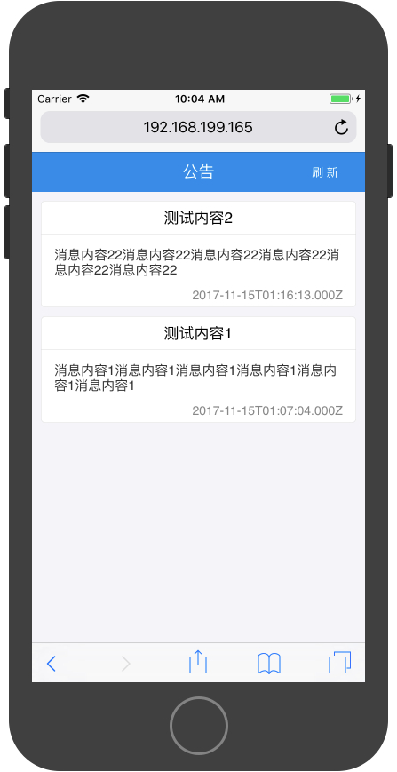

# 第11章 异步编程

异步操作是一个非常重要的概念，也是移动应用开发的基础。本章我们对异步操作进行学习。

## 11.1 基本概念
异步和同步是代码运行的两种模式我们首先生活中的实际场景，讲解同步和异步的区别。

假设在家中，我们有两件事，烧水和洗衣服(手洗)。烧水需要10分钟，洗衣服需要20分钟。那么问，两件事都做完，需要多长时间？有两种答案：30分钟和20分钟。这两个答案都对，区别就是同步和异步。

如果回答30分钟，那么就是同步操作，我先烧水，等水烧烤了，我再洗衣服，一共30分钟

如果回答是20分钟，那么就是异步，我先烧水，然后去洗衣服，洗衣服途中，水烧开了，暂停洗衣服，将水灌入暖壶，继续洗衣服，一共20分钟。

这里我们看，为什么烧水和洗衣服可以同时进行。

因为烧水这个操作，我们需要做的就是把水放到燃气上打开火，等水烧开灌入暖壶。这两个操作都是几乎不耗费时间的。但是燃气将水加热的过程是非常耗时的，而这个耗时过程我们能做的只是等待。这种情况下，我们可以将原本的等待时间做其他的事情。等水烧烤之后，我们暂时中止正在做的事情，然后将烧水的过程结束。这个过程就是异步操作。

异步操作需要提供一个开启方法和结束事件接口。

### 11.1.2 基本代码

异步操作的核心是一个只能等到的耗时操作，在移动应用开发中这样的操作为以下几种：

* 网络通讯
* 数据库操作
* 文件读写

在此处，我们将问题简化，通过一个定时器来模拟一个耗时操作。

```
//setTimeout(func,mseconds);
//func为一个函数对象，
//seconds，为整数
//在seconds毫秒之后，执行func所封装的操作

console.log(1);
setTimeout(()=>{
	console.log(2);
},1000)
//输出1，经过一秒钟之后，输出2
```
我们通过函数封装一个异步操作

```
function func1(){
	console.log('任务开始');
	setTimeout(()=>{
		console.log('任务结束');
	},1000);
}
```
调用此异步操作

```
func1();
console.log('xxx');

//输出结果
//任务开始
//xxx
//经过1秒钟等待
//任务结束
```

### 11.1.3 异步回调事件接口

开启异步操作之后，我们通常需要在异步操作结束之后，做一些列的操作。例如水烧开了之后需要灌入暖和等。所以我们需要有一种机制，可以在异步操作结束之后，告知我们。这便是异步回调事件接口。

```
function func1(){
	console.log('任务开始');
	setTimeout(()=>{
		console.log('任务结束');
	},1000);
}
```
这个异步操作函数没有异步事件回调接口，所以我们无法再其完成之后做任何操作。

我们一般使用的异步操作函数都具有回调接口

```
function func1(callBack){
	console.log('任务开始');
	setTimeout(()=>{
		console.log('任务结束');
		callBack();
	},1000);
}
```
回调接口的实现是通过一个函数对象参数。当一般操作完成是，调用该函数对象。

使用代码回调接口的异步操作函数方法如下：

```
const action = ()=>{
	console.log('success');
}
func1(action);//在任务完成之后输出success
```
通常我们不使用中间变量`action`，而是将箭头函数直接写入函数参数：

```
func1(()=>{
	console.log('success');
});
```

## 11.2 异步函数

### 11.2.1 使用定时器构造异步函数

我们还是通过`setTimeout`定时器模拟异步操作，构造异步操作函数

我们构建一个异步求和函数

>这里解释下，异步求和操作非实际需求，举这个例子只为更简单的讲解异步操作和同步操作的不同

首先构造一个同步的求和函数
```
function add(x,y){
	return x+y;
}
```
这个同步的操作函数非常简单，输入为函数参数变量，函数的返回值通过`return`返回，其调用过程也非常简单

```
const sum = add(1,2);
```
**但异步函数的构造和调用有于同步函数有不同之处，这里需要重点强调**

我们还是构造一个求和函数，但这个求和函数是异步的，就是需要一些耗时过程才能将结果返回。

构造异步函数时，我们需要注意一点，**异步函数中返回的数据不能使用`return`，而要使用事件接口进行回传**

首先我们解释为什么不能使用`return`：

先看一段简单的代码
```
let a;
let b = a;
a = 2
console.log(b);//输出为null，因为在用a为b赋值时，a的值还不存在。
```
同样，我们看下一代代码

```
function func1(x,y){
	console.log(x+y);
}

const sum = func1(1,2);
console.log(sum);//输出null，因为func1无返回值，而sum的值来自于func1返回，所以sum为null
```

这两段代码都能理解，我们就更容易理解，为什么异步函数不能用`return`返回数据了，我们继续看下面的代码

```
function func1_asyn(x,y){
	setTimeout(()=>{
		return x+y;
	},1000);
}

const sum = func1_asyn(1,2);
console.log(sum);//数据结果？
```
这段代码的输出结果依然为`null`,这可能与大家想象的不一样，那么我们就来分析为什么。

我们首先对这段代码添加一些log，测试其输出过程

```
function func1_asyn(x,y){
	console.log(2);
	setTimeout(()=>{
		console.log(5);
		return x+y;
	},1000);
	console.log(3);
}

console.log(1);
const sum = func1_asyn(1,2);
console.log(sum);
console.log(4);
```
上述log的顺序为 1 2 3 4 等1秒 5，注意这个顺序，重新阅读下代码。

我们通过上述代码可以看出，字符4的打印是在sum赋值之后，而字符5的打印是在函数返回值之前，也就是说，在函数返回数据之前，sum已经被赋值了，这时sum的值为null，所以在异步操作中，不能用return，**因为，在函数内部返回数据的时间晚于函数外部使用数据的时间，这个时间差是无法避免的**。

为了解决异步函数返回数据的问题，我们使用异步函数的事件接口来返回数据。

```
//在异步函数中，添加一个callBack函数对象参数
//作为异步操作完成时的事件回调接口
function add_asyn(x,y,callBack){
	setTimeout(()=>{
		const sum = x+y;
		//使用事件回调接口，代替return
		//通过调用函数对象，并携带参数，回传函数返回值
		callBack(sum);
	},1000)
}
```
使用异步函数事件接口，接收函数返回值

```
add_asyn(1,2,(sum)=>{
	console.log(sum);
})
```
但要注意，一下使用方法是错误的

```
let s = 0;

add_asyn(1,2,(sum)=>{
	s = sum;
})

console.log(s);//输出结果为0
```
大家思考一下，为什么输出结果为0，这也是刚刚接触异步操作的非常容易犯的错误。

为了方便分析，我们还是在代码中添加`console.log()`语句。

```
let s = 0;
console.log(1);
add_asyn(1,2,(sum)=>{
	console.log(3);
	s = sum;
	
})
console.log(s);//输出结果为0
console.log(2);
```
打印输出顺序为：1 s的值 2 等待1秒 3

从打印顺序可以看出来，当字符2打印时，已经使用了s变量的值，而字符3打印时，才会为s变量赋值，所以，使用变量数据发送在为变量赋值之前，出现错误。


### 11.2.2 异步操作控制

异步操作的流程控制比同步难实现，我们通过两个例子讲解常用的异步操作控制。

#### 异步操作并行执行

现在有两个异步函数，分别返回两个字符串

```
function getAString(callBack){
	setTimeout(()=>{
		callBack('xxx');
	},987);
}

function getBString(callBack){
	setTimeout(()=>{
		callBack('yyy');
	},897);
}
```
现在需求是，将获取到的两个字符串进行拼接后打印，要求A字符串在前B在后。

首先演示多种错误做法

```
const a = getAString();
const b = getBString();

console.log(a+b);
```

```
getAString((aString)=>{

});

getBString((bString)=>{

});

console.log(aString+ bString);

```

```
let a;
let b;

getAString((aString)=>{
	a = aString;
});

getBString((bString)=>{
	b = bString;
});

console.log(a+b);

```

三种错误原因需要明确

* 异步函数不能直接获取其返回值
* 超出`aString`和`bString`的变量作用域
* 使用变量值发生在为变量赋值操作之前

下面讲解正确的打开方式，首先看代码

```
let a = null;
let b = null;

getAString((aString)=>{
	a = aString;
	if(b != null){
		console.log(a+b);
	}
});

getBString((bString)=>{
	b = bString;
	if(a != null){
		console.log(a+b);
	}
});

```
异步操作的一个特点是，操作结束时间在编程时是一个未知量，我们在练习是用`setTimeout`模拟异步操作，对其时间都是一个固定值，但真是的异步操作在执行是无法获取其准确完成时间，比如我们向服务器请求一个数据，这个数据从请求开始到成功获取，具体时间由很多因素决定。

基于这样一个特点，我们在同时执行两个异步操作时，无法判断，哪一个异步操作会先完成，哪一个是后完成。所以我们只能在一个完成之后，去判断另一个是否已经完成。在这个案例中，完成的标识就是所请求的数据是否存在，如果a存在，就表示获取a字符串的异步操作已经完成，如果不存在，就说明为完成。

所以我们在获取一个字符串数据之后，还需要判断另一个操作是否完成，完成的话，我们在有两个字符串的数据，进行打印，如未完成，仅对变量赋值，不进行打印操作。

这种同时执行多个异步操作叫做**异步并行执行**，通常我们需要在所有并行的异步操作都完成之后，在执行下一个操作。

但这样解决方案有个问题，就是在并行操作数量增加是，每个异步操作中都需要判断其他所有操作是否完成，代码复杂度成指数上升，为解决这个问题，下一章我们会讲解Promise机制来解决这个问题。

#### 异步操作串行执行

串行执行就是一个异步操作执行完成之后，在执行另一个异步操作。

比如我们举一个例子，新浪微博的登陆过程分两步

* 通过用户名和密码登陆
* 登陆成功之后获取微博列表

这两步操作要依次执行，因为只有登陆成功之后才有获取微博列表的权限。

首先构造两个函数，分别执行登陆和获取微博的异步操作

```
function login(username,password,callBack){
	setTimeout(()=>{
		//模拟验证密码过程
		if(password =='1234'){
			callBack(true);
		} else {
			callBack(false);
		}
	},1000);
}

function getWeibo(callBack){
	setTimeout(()=>{
		callBack('这里是微博信息');
	},1000)
}
```

异步操作的串行执行，需要在一个完成之后再调用另一个

首先演示错误做法

```
login();
const weibo = getWeibo();
console.log(weibo);
```
```
const result = login();
if(result == true){
	const weibo = getWeibo();
	console.log(weibo);
}
```

```
login((result)=>{
	console.log(result);
})
if(result == true){
	const weibo = getWeibo();
	console.log(weibo);
}
```
```
let r;

login((result)=>{
	r = result;
})
if(r == true){
	const weibo = getWeibo();
	console.log(weibo);
}

```

以上代码错误原因：

* 这两个操作都是异步操作，此为同步调用
* 这两个操作都是异步操作，此为同步调用
* 这两个操作都是异步操作，此为同步调用，且result超出作用域
* 这两个操作都是异步操作，此为同步调用

正确代码

```
login((result)=>{
	if(result == true){
		getWeibo((weibo)=>{
			console.log(weibo);
		});	
	} else {
		console.log('登录失败');
	}
})
```
在异步串行执行过程中，下一步操作需要在上一步完成的事件回调接口中进行调用，这样才能保证，异步按照顺序依次执行。但如果串行步骤过多，就会造成代码嵌套层数增加，影响代码阅读性和可维护性，我们在下一章节讲解的Promise机制，能有效的解决这个问题。

## 11.3 Promise


在上一章内容中，讲解了异步操作的的相关问。但因为上一章采用的函数事件接口机制来提供异步操作的完成事件回调，造成在异步的流程控制方面有诸多问题，但随着需求的复杂和任务难度的提升，异步流程控制的需求也会更加复杂，穿透事件接口以无法应对，因此ES6语法中，增加了Promise机制，来完善异步操作的流程控制问题。

在Promise的机制中，所有异步操作使用Promise对象进行封装，此对象可以由函数直接返回，并不需要事件接口的函数对象来完成。返回的对象具有统一的操作接口，来响应异步完成的回调事件。


### 11.3.1 基本用法

在ES6中，可以直接使用Promise关键字，无需任何引用。

```
//构造一个异步操作
const action = ()=>{
	console.log('任务开始');
	setTimeout(()=>{
		console.log('任务结束');
	},1000)
}
```
```
//创建一个Promise对象，通过Promise对象可以封装异步操作
const promise = new Promise(action);
```
这样的封装不完整，无法提供异步操作的完成事件接口，例如，我想在任务完成之后，打印一个`success`，现在是无法操作的。

Promise通过对异步操作提供两个标准事件接口函数对象来完成了这项功能的支持。

```
//构造一个异步操作
//如果该异步操作被Promise对象封装
//Promise会提供两个函数对象：callBack，reject
//调用callBack函数对象，表示异步操作完成
//调用reject函数对象，表示异步操作出现错误，未完成
//这两个函数对象，只能调用一次，再次调用无效
const action = (callBack,reject)=>{
	console.log('任务开始');
	setTimeout(()=>{
		console.log('任务结束');
		callBack();
	},1000)
}

const promise = new Promise(action);
```

通过`then()`和`catch()`两个函数响应操作完成回调和操作为完成回调。

```
promise
.then(()=>{
	console.log('success');
})
.catch(()=>{
	console.log('error');
})
```
当异步操作内部调用`callBack`函数对象是，外部`then()`函数中的代码会运行。当内部调用`reject`时，外部的`cathc()`函数中的代码会运行。

通过Promise封装的异步操作，可以不需要外界提供事件回调接口，因为自身有标准的接口可供使用。基于Promise构造的异步操作函数就非常简单了。

我们使用Promise封装一个异步求和函数

```
//函数输出为x，y，不需要事件接口
function asyn_add(x,y){
	//构造异步操作
	const action = (callBack,reject)=>{
		setTimeout(()=>{
			const sum = x+y;
			//通过Promise提供的callBack可以携带最多一个参数
			callBack(sum);
		})
	};
	//使用Promise封装异步操作
	const promise = new Promise(action);
	//返回Promise对象
	return promise;

}
```

调用异步Promise封装的异步操作

```
asyn_add(1,2)
.then((sum)=>{
	console.log(sum);
})
.catch(()=>{
	console.log('操作失败');
})
```

### 11.3.2 并行异步操作

我们首先封装两个异步获取字符串的操作

```
function getAString(){
	const action = (callBack,reject)=>{
		setTimeout(()=>{
			callBack('xxx');
		},1000);
	};
	const promise = new Promise(action);
	return promise;
}

function getBString(){
	const action = (callBack,reject)=>{
		setTimeout(()=>{
			callBack('yyy');
		},1000);
	};
	const promise = new Promise(action);
	return promise;
}
```

现在需求是，获取两个字符串后，将字符串拼接打印。

这是一个异步并行问题，在传统的回调函数中，我们需要做判断进行处理，而在Promise机制下，我们引入`Promise.all()`函数来执行并行的异步操作，并提供一个统一的完成回调。

```
//首先将要执行的异步操作放入数组
const actions = [
	getAString(),
	getBString()
];
//使用all()函数执行数组中所有操作
//当数组中所有异步操作都完成时，then回触发其方法
//携带一个数组，数组中依次装有异步操作完成时返回的数据
Promise.all(actions)
.then((results)=>{
	const aString = results[0];
	const bString = results[1];
	console.log(aString+ bString);
});
```

### 11.3.3 串行异步操作

串行执行就是一个异步操作执行完成之后，在执行另一个异步操作。

比如我们举一个例子，新浪微博的登陆过程分两步

* 通过用户名和密码登陆
* 登陆成功之后获取微博列表

这两步操作要依次执行，因为只有登陆成功之后才有获取微博列表的权限。

首先构造两个函数，分别执行登陆和获取微博的异步操作

```
function login(username,password){

	const action = (callBack,reject)=>{
		setTimeout(()=>{
			//模拟验证密码过程
			if(password =='1234'){
				callBack(true);
			} else {
				callBack(false);
			}
		},1000);
	}
	const promise = new Promise(action);
	return promise;
}

function getWeibo(){
	const action = (callBack,reject)=>{
		setTimeout(()=>{
			callBack('这里是微博信息');
		},1000)
	}
	const promise = new Promise(action);
	return promise;
}
```

异步操作的串行执行，需要在一个完成之后再调用另一个

```
login()
.then(()=>{
	//在一个异步结束中，可以返回另一个异步操作
	//然后在下一个then函数中处理后续的操作
	return getWeibo();
})
.then((weibo)=>{
	console.log(weibo)
})
.cahch(()=>{
	console.log('登录失败')
})
```

### 11.3.4 async函数

ES2017 标准引入了 async 函数，使得异步顺序操作可以像同步一样进行处理。

首先我们通过Promise构造两个模拟的异步函数：

```
function prosessA(){
  return new Promise((callBack,reject)=>{
    setTimeout(()=>{
  		callBack('A');
  	},1000)
  })
}

function prosessB(){
  return new Promise((callBack,reject)=>{
    setTimeout(()=>{
  		callBack('B');
  	},1000)
  })
}```

然后我们使用async函数封装两个异步操作依次执行过程：

```
async function doAB(){
  console.log('1');
	const a =  await prosessA();
	console.log(a);
	const b =  await prosessB();
	console.log(b);
	//此函数可以返回值，但作为Promise的回调参数
	return true;
}
```

调用此函数：

```
doAB().then((r)=>{
  console.log(r);
})
```
输出结果为：

```
1
A
B
true
```

## 11.4 fetch操作

网络请求是移动端非常重要的知识点，在移动端运行过程中，始终需要和后台API进行通信，获取后台提供的数据同时将用户产生的数据提交后台。

在网络请求中，可以分为四类网络请求

* GET请求
* POST-传统表单
* POST-JSON表单
* POST-文件表单

移动端的API返回的数据，如无特殊标注，数据格式都为JSON。

请求操作通过`fetct`接口进行，该接口原本为浏览器接口，无需引入可以直接使用，在ReactNative框架中，仿照原本的`fetch`在框架内做了同样的实现。

`fetch`请求为Promise回调，回调函数携带服务器的响应`response`对象

```
fetch(url,options)
.then((response)=>{
	//请求成功
})
.catch((error)=>{
	//请求失败
})
```

`url`为请求地址，通常在API文档中注明

`options`为请求配置项，有如下字段

|字段名|作用|
|:---|:---|
|method|请求方式，GET,POST默认为GET|
|headers|请求头对象|
|body|POST请求的body|


`response`对象为原始返回数据对象，其自带三个数据解析方法

* `json()`对响应数据进行JSON解析
* `text()`对响应数据进行文本解析
* `blob()`对响应数据进行二进制数据解析

这三个函数都是异步操作，回调为Promise。

通常移动API返回的数据都是JSON格式，请求完成后进行数据解析

```
fetch(url,options)
.then((response)=>{
	return response.json();
})
.then((data)=>{
	//API返回的数据
	console.log(data);
})
.catch((error)=>{
	//请求出错
})
```

利用箭头函数的简写特性，通常将上述代码做如下调整:

```
fetch(url,options)
.then((response)=> response.json())
.then((data)=>{
	//API返回的数据
	console.log(data);
})
.catch((error)=>{
	//请求出错
})
```

这个写法使用了箭头函数的简化特性，在没有`{}`包裹的函数体时，箭头只能有一个表达式，同时该表达式为箭头函数的返回值，即：

```
()=>{
	return 1;
}
```
与下面代码作用相同

```
()=> 1
```

### 11.4.1 GET请求

GET请求是最常用，最简单的请求方式，用于App从后台API获取数据。

首先我们先构造一个API接口

请求路径：`http://localhost:5001/api/getUsers`

请求方式： GET

请求参数： 无

确定API文档之后，我们便可以开始进行网络请求：

```
const url = 'http://localhost:5001/api/getUsers';
fetch(url)
.then((response)=>response.json())
.then((data)=>{
	console.log(data)
})
.catch((error)=>{
	console.log('请求失败')
})
```

上面我们讲解的是最简单的GET请求，下面我们进行一个带参数的GET请求操作

请求路径：`http://localhost:5001/api/getUser`

请求方式： GET

请求参数：

|参数名 | 作用 |
| :--- | :--- |
| id |获取指定id的User信息 |

在有请求参数的GET请求中，我们将请求参数拼接到请求地址后，以`?`进行分割，如果有多个参数，参数之间用`&`分隔。例如：`http://localhost:5001?name=Tom&age=10`

```
const url = 'http://localhost:5001/api/getUsers?id=1';
fetch(url)
.then((response)=>response.json())
.then((data)=>{
	console.log(data)
})
.catch((error)=>{
	console.log('请求失败')
})
```

### 11.4.2 POST传统表单

请求路径：`http://localhost:5001/api/createUser1 `

请求方式：POST，传统表单

请求参数：

|参数名 | 作用 |
| :--- | :--- |
| name |用户姓名 |
| age | 用户年龄|

在使用`fetch`提交传统表单是，需要将参数构造一个键值对字符串，例如

```
name=Tom&age=10
```

然后将此键值字符串放入body中

```
const url = 'http://localhost:5001/api/createUser1';
const body = 'name=Tom&age=10'
fetch(url,{
	method:'POST',
	"Content-Type":"application/x-www-form-urlencoded"
	body: body,
})
.then((response)=>response.json())
.then((data)=>{
	console.log(data)
})
.catch((error)=>{
	console.log('请求失败')
})

```
此种提交方式现在已经不常见，作为了解即可。

### 11.4.3 POST提交JSON表单

目前移动端API几乎全部采用JSON表单进行数据提交。

请求路径：`http://localhost:5001/api/createUser2`

请求方式：POST，JSON表单

请求参数：

|参数名 | 作用 |
| :--- | :--- |
| name |用户姓名 |
| age | 用户年龄|

在使用`fetch`提交JSON表单时，需要安装参数要求，创建一个参数对象，然后将对象JSON编码之后，放入`body`中

```
const url = 'http://localhost:5001/api/createUser2';
const body = JSON.stringify({
	name:'Tom',
	age:10
})
fetch(url,{
	method:'POST',
	"Content-Type":"application/json",
	body: body,
})
.then((response)=>response.json())
.then((data)=>{
	console.log(data)
})
.catch((error)=>{
	console.log('请求失败')
})

```

### 11.4.4 POST提交文件表单

在移动端操作是，上传文件是频率很高的操作，例如发朋友圈，修改头像等。

我们这里以上传图片为案例进行操作。

请求路径：`http://localhost:5001/api/setUserImage`

请求方式：POST

请求参数：

|参数名 | 作用 |
| :--- | :--- |
| id |用户Id|
| image | 用户头像|

在使用`fetch`提交文件表单时，需要使用`FormData`对文件进行包装：

```
const formData = new FormData();
//包装字段
formData.append('id',1);
//包装文件
formData.append('image',{
	uri:'文件路径'，
	name:'文件名',
	type:'文件类型'
})
```
然后将`formData`对象放入`body`中。

```
const formData = new FormData();
//包装字段
formData.append('id',1);
//包装文件
formData.append('image',{
	uri:'./1.png'，
	name:'1.png',
	type:'image/png'
});

const url = 'http://localhost:5001/api/setUserImage';

fetch(url,{
	method:'POST',
	"Content-Type":"multipart/form-data",
	body: formData,
})
.then((response)=>response.json())
.then((data)=>{
	console.log(data)
})
.catch((error)=>{
	console.log('请求失败')
})


```

## 项目实战 公告栏

### 项目简介



此项目为一个移动端页面，请求后台的公告并展示。

项目中使用的技术栈有：

* React.js框架
* Ant Design样式框架
* JavaScript 异步编程
* Fetch网络请求

### 公告元数据

公告元数据有4个字段：

* `id`:唯一自增编号，数据库自动生成。不一定连续
* `title`：公告标题
* `content`：公告内容
* `createAt`：公告时间

### API服务文档

API提供此项目的数据服务，页面通过请求API接口获取数据或提交数据

API请求基础地址为本机IP，**注意不能写`localhost`**。端口为3000。

#### 获取所有公告

请求相对地址：`/api/getMessages`

请求方式：`GET`

请求参数：无

返回值类型：`application/json`

```
[
	公告元数据对象,
	...
]
```
#### 发布公告

请求相对地址：`/api/postMessage`

请求方式：`POST`

请求参数：

|参数名|参数描述|
|:---|:---|
|title|公告标题|
|content|公告内容|

返回值类型：`application/json`

```
{
	success:true,//失败为false
}
```

#### 删除公告

请求相对地址：`/api/deleteMessage`

请求方式：`POST`

请求参数：

|参数名|参数描述|
|:---|:---|
|id|公告id|

返回值类型：`application/json`

```
{
	success:true,//失败为false
}
```

### API实现源码

```
//引入Sequelize框架
import Sequelize  from 'sequelize';
//引入Express框架
import express from 'express';
//引入body解析工具
import bodyParser from 'body-parser';

//构造sequelize对象
const sequelize = new Sequelize(
  'api',
  'root',
  '',
  {
    'dialect': 'mysql',  // 数据库使用mysql
    'host': 'localhost', // 数据库服务器ip
    'port': 3306         // 数据库服务器端口
  }
);

//定义数据模型
const Message = sequelize.define('message',{
	title:Sequelize.STRING,
	content:Sequelize.STRING,
});

//同步数据模型到数据库
sequelize.sync();

//通过Express框架创建一个ExpressApp对象
const app = express();

//添加body解析中间件
app.use(bodyParser.json());

//支持跨域请求
app.use((req,res,next)=>{
    res.header('Access-Control-Allow-Origin','*');
    res.header("Access-Control-Allow-Headers", "Content-Type");
    res.header("Access-Control-Allow-Methods", "POST,GET");
    next();    
})


//使用app的get函数，配置请求路由和响应函数
//响应函数携带req和res两个对象
//req是请求对象，包含请求所携带的全部信息
//res是响应对象，通过对res操作，可以将服务端数据返回客户端
app.get('/api/getMessages', (req, res)=>{
	//通过req获取用户提交的参数
	//req中的query字段包含了用户通过GET请求提交的全部参数
	const query = req.query;
    
    Message
    .findAll({
        order:[['id','DESC']]
    })
    .then((messages)=>{
        res.json(messages);
    });
});

app.post('/api/postMessage',(req,res)=>{
	//使用body-parser之后，req中的body会包含用户提交的参数
	const body = req.body;
	//打印测试
    console.log(body);
    Message.create({
        title:body.title,
        content:body.content
    });
	res.json({success:true});
})

app.post('/api/deleteMessage',(req,res)=>{
	//使用body-parser之后，req中的body会包含用户提交的参数
	const body = req.body;
	//打印测试
    console.log(body);
    Message.destroy({where:{id:body.id}})
    .then(()=>{
      // 删除成功
      console.log('删除成功');
      res.json({success:true});
    })
    .catch((err)=>{
      // 出错了
      console.log(err);	
    })
    
	//res.json({success:true});
})

//开启监听服务
const server = app.listen(3000,'本机IP地址');
```

### 移动端页面源码实现

```
//index.html

<!DOCTYPE html>
<html lang="en">
<head>
	<meta charset="UTF-8">
	<title>Document</title>
	<link rel="stylesheet" href="css/index.css">
	<script src="js/jquery.min.js"></script>
	<script src="js/index.js"></script>
</head>
<body>
	<header>
		<span>公告</span>
		<button class="button">刷新</button>
	</header>
	<div class="tanceng">
		请稍等，正在玩命加载。。。
    </div>
	<!-- 内容 -->
	<div id ="syk">
		<!-- <div class="content">
			<span>标题：</span>
			<div>内容：</div>
			<span>时间：</span>
		</div> -->
	</div>
</body>
</html>

```

```
//index.css

body {
  margin: 0;
  padding: 0;
  font-family: sans-serif;
}
/*头部*/
header{
	text-align: center;
	background: #108ee9;
	width: 100%;
	height: 45px;
	line-height: 45px;
	font-family: "微软雅黑";
	font-size: 16px;
	color: #fff;
}
header button{
	position: absolute;
	top: 10px;
	right: 10px;
	padding: 5px 10px;
	background: #108ee9;
	color: #fff;
	border:0;
}
header button:hover{
	background: #0e80d2;
}
/*刷新显示弹出层*/
.tanceng{
	display:none;
	width:15%;
	height:100px;
	line-height: 100px;
	padding: 0 10px;
	position:absolute;
	top:30%; 
	left:42%;
	background-color:rgb(45, 45, 45);
	z-index:5000;
	opacity:0.7;
	color: #fff;
	font-size: 1em;
	border-radius: 6px;
	text-align: center;
	background-position:initial initial;
	background-repeat:initial initial;
}
/*内容*/
.content{
	width: 98%;
	height: 120px;
	margin:7px 1%;
	border:1px solid #ddd;
	border-radius: 6px;
}
.content span:nth-child(1){
	display: block;
	width: 100%;
	height: 30px;
	line-height: 30px;
	text-align: center;
	border-bottom: 1px solid #ddd;
}
.content div{
	display: block;
	height: 53px;
	line-height: 20px;
	margin:10px 20px 0px;
}
.content span:nth-child(3){
	display: block;
	text-align: right;
	padding-right:10px; 
	font-size: 14px;
}
```

```
//index.js

$("button").mousedown(function(){
	$ ('.tanceng').show ();
	fetch('http://192.168.199.165:3000/api/getMessages')
	.then((response)=>{
		return response.json();
	})
	.then((jsonData)=>{
		$ ('.tanceng').fadeOut ();
		$("#syk").empty();
		var item=""; 
		$.each(jsonData,(i,result)=>{
			item='<div class="content"><span>'+result['title']+'</span><div>'+result['content']+'</div> <span>'+result['createdAt']+'</span></div>';			  	  
			$("#syk").append(item);  
		})
	})
});

$(function(){
	$ ('.tanceng').show ();
	fetch('http://192.168.199.165:3000/api/getMessages')
	.then((response)=>{
		return response.json();
	})
	.then((jsonData)=>{
		$ ('.tanceng').fadeOut ();
		var item=""; 
		$.each(jsonData,(i,result)=>{
			item='<div class="content"><span>'+result['title']+'</span><div>'+result['content']+'</div> <span>'+result['createdAt']+'</span></div>';			  	  
			$("#syk").append(item);  
		})
	})
});

```