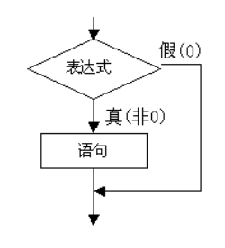
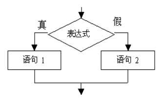
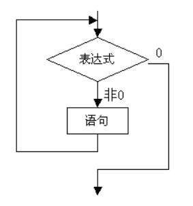
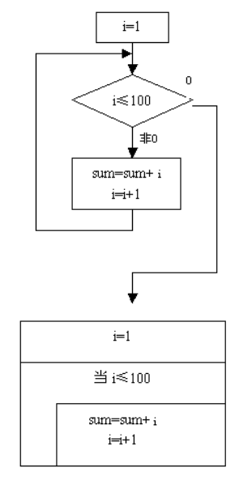
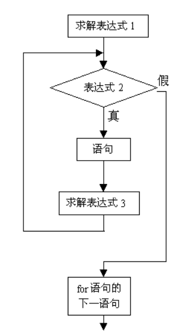

# 第5章 分支结构与循环

## 5.1 条件语句

### 5.1.1 if 条件假设语句

if 条件假设语句是比较简单的一种选择结构语句，若给定的逻辑条件表达式为真，则执行一组给定的语句。其基本结构如下：

```
if (conditions) {
		statements;
}
```



逻辑条件表达式conditions 必须放在小括号里，且仅当该表达式为真时，执行大括号内包含的语句，否则将跳过该条件语句而执行其下的语句。大括号内的语句可为一个或多个，当仅有一个语句时，大括号可以省略。但一般而言，为养成良好的编程习惯，同时增强程序代码的结构化和可读性，建议使用大括号将指定执行的语句括起来。

if 后面可增加else 进行扩展，即组成`if…else` 语句，其基本结构如下：

```
if(conditions){
	statement1;
} else {
	statement2;
}
```



当逻辑条件表达式conditions 运算结果为真时，执行statement1 语句（或语句块），否则执行statement2 语句（或语句块）。if(或if…else)结构可以嵌套使用来表示所示条件的一种层次结构关系。值得注意的是，嵌套时应重点考虑各逻辑条件表达式所表示的范围。

### 5.1.2 switch 流程控制语句

在if 条件假设语句中，逻辑条件只能有一个，如果有多个条件，可以使用嵌套的if 语句来解决，但此种方法会增加程序的复杂度，并降低程序的可读性。若使用switch 流程控制语句就可完美地解决此问题，其基本结构如下：

```
switch (a) {
	case a1:
		statement 1;
		break;
	case a2:
		statement 2;
		break;
	……
	default:
	[statement n;]
}
```
其中a 是数值型或字符型数据，将a 的值与a1、a2、……比较，若a 与其中某个值相等时，执行相应数据后面的语句，且当遇到关键字break 时，序跳出statement n 语句，并重新进行比较；若找不到与a 相等的值，则执行关键字default 下面的语句。

## 5.2 循环

循环结构是程序中一种很重要的结构。其特点是，在给定条件成立时，反复执行某程序 段，直到条件不成立为止。给定的条件称为循环条件，反复执行的程序段称为循环体。JavaScript语言提供了多种循环语句，可以组成各种不同形式的循环结构。

常用循环控制语句有：

* while循环
* for循环

### 5.2.1 while循环

while 语句的一般形式为:

```
while(表达式){
	语句;
	...
}
```
while 语句的语义是:计算表达式的值，当值为真(非 0)时， 执行循环体语句。其执行过程可用下图表示。



【例 5.1】用 while 语句求1+2+...+99+100的值

用传统流程图和 N-S 结构流程图表示算法，见图:



代码描述为：

```
let i = 1;
let sum = 0;

while(i <= 100){
  sum=sum+i;
  i++;
}

console.log(sum);
```

### 5.2.2 for循环

在JavaScript语言中，for 语句使用最为灵活，它完全可以取代 while 语句。它的一般形式为:

```
for(表达式 1;表达式 2;表达式 3){
	语句;
}
```

它的执行过程如下:

1. 先求解表达式1。
2. 求解表达式2，若其值为真(非0)，则执行for语句中指定的内嵌语句，然后执行下面第3步;若其值为假(0)，则结束循环，转到第5步。
3. 求解表达式3。
4. 转回上面第2)步继续执行。
5. 循环结束，执行for语句下面的一个语句。
其执行过程可用下图表示。



for 语句最简单的应用形式也是最容易理解的形式如下:

```
for(循环变量赋初值;循环条件;循环变量增量){
	语句
}
```


循环变量赋初值总是一个赋值语句, 它用来给循环控制变量赋初值; 循环条件是一个 关系表达式,它决定什么时候退出循环;循环变量增量，定义循环控制变量每循环一次后 按什么方式变化。这三个部分之间用`;`分开。

例如:

```
let sum = 0;
for(let i=1; i<=100; i++){
	sum=sum+i;
}
```

先给i赋初值1,判断i是否小于等于100, 若是则执行语句,之后值增加1。再重新判断, 直到条件为假,即 i>100 时,结束循环。

### 5.2.3 break语句

break 语句通常用在循环语句和开关语句中。当 break 用于开关语句 switch 中时,可使 程序跳出 switch 而执行 switch 以后的语句;如果没有 break 语句,则将成为一个死循环而 无法退出。break 在 switch 中的用法已在前面介绍开关语句时的例子中碰到,这里不再举例。

当break语句用于for、while循环语句中时,可使程序终止循环而执行循环 后面的语句, 通常 break 语句总是与 if 语句联在一起。即满足条件时便跳出循环。

## 5.3 循环应用

### 5.3.1 求π的近似值

π/4 = 1 - 1/3 + 1/5 - 1/7 + ... 

解答：

```
let sum = 0;

for(let i = 0;i<1000;i++){
	if(i%2 == 0){
		sum += 1/(2*i + 1);
	}
	else {
		sum -= 1/(2*i + 1);
	}
}

console.log(sum*4);
```
### 5.3.2 求一个数的约数

约数，又称因数。整数a除以整数b(b≠0) 除得的商正好是整数而没有余数，我们就说a能被b整除，或b能整除a。a称为b的倍数，b称为a的约数。

例如 10 = 1 * 10 = 2 * 5；那么1、2、5、10即为10的约数。

可以看出，一个数的约数有1和其本身。

```
const m = 24;//可以为任意数

for(let i = 1;i <= m;i++){
	if(m%i == 0){
		console.log(i);
	}
}
```

### 5.3.3 判断一个数是否素数 

质数定义为在大于1的自然数中，除了1和它本身以外不再有其他约数。

```
const m = 24;

let isPrimeNumber = true;

for(let i = 2;i<m;i++){
	if(m%i == 0){
		isPrimeNumber = false;
		break;
	}
}

if(isPrimeNumber == true){
	console.log(`${m}为素数`);
} else {
	console.log(`${m}不是素数`);
}
```


### 5.3.4 求两个数的最大公约数

例如 求64和48这两个数的最大公约数，需要首先列出其所有的约数

64的约数有 1 2 3 4 6 8 16 32 64
48的约数有 1 2 3 4 6 8 12 16 24 48

通过观察可以看出，最大公约数为16。

但计算机不能通过观察得出结论，只能通过计算，我们的计算规则也非常简单，就是一个数一个数的试。

```
const m = 64;
const n = 48;

const min = m>n?n:m;

let maxDivisor = 1;

for(let i = 1;i <= min;i++){
	if(m%i == 0 && n%i == 0){
		maxDivisor = i;
	}
}
console.log(maxDivisor);
```

## 项目实战：马拉松比赛排名系统

### 项目背景

马拉松（Marathon）长跑是国际上非常普及的长跑比赛项目，全程距离26英里385码，折合为42.195公里（也有说法为42.193公里）。分全程马拉松（Full Marathon）、半程马拉松（Half Marathon）和四分马拉松（Quarter Marathon）三种。以全程马拉松比赛最为普及，一般提及马拉松，即指全程马拉松。

马拉松的魅力之一，是比赛场地的开放。其他体育项目，只要是可以用来比赛的，要么是似曾相识的一块地，要么是司空见惯的一个圈，而马拉松赛的场地多从城市道路选取，对参赛者来说，每跑一步、每过一段都是不同的风景。魅力之二，是对参赛者的包容。其他体育项目，只有同等选手才能同场竞技，业余爱好者几乎不可能与专业运动员pk，而马拉松赛不同，无论专业运动员还是业余爱好者，大家都可以挤在一起比赛。马拉松的魅力显然不止两个，但不可否认，正是开放与包容这两个原因，让马拉松给人们带来了更多欢乐。

城市马拉松比赛参赛人数非常多，在万人规模。所以在竞技排名方面依靠传统的人工计算以不能满足效率要求。

### 项目技术要求
本系统采用计算机算法进行快速准确的成绩排序，生成准确的名次手册，共组委会使用。

本次处理5000人比赛计时数据。数据由三部分组成：

* 选手姓名和选手号码对应表
* 选手冲线名次和选手号码对应表
* 选手完赛时间和选手号码对应表

系统对上述数据进行处理之后，输出一个以名次升序排列的表。包含选手号码，选手名称，完赛时间。

|名次|选手号码|选手姓名|完赛时间|
|:---|:---|:---|:---|
|1|205|Tom|2:05:45|
|2|103|Jhon|2:06:00|
|...|...|...|...|
|5000|3001|Tuoma|6:06:12|


### 构建测试数据

构建测试数据是开发应用系统的第一个环节，依照项目背景和技术要求构造可以用于模拟，测试的数据。

选手姓名与号码数据

|号码|姓名|
|:---|:---|
|1|埃里克斯松·塔尔|
|2|李宗亭|
|3|罗尼伦·塔布|
|4|喜多秀喜|
|5|宗茂|
|6|儿玉泰介|
|7|朱玛·依坎加|
|8|阿贝贝|
|9|彼得·达尔|
|10|杜比|

选手名次与号码数据

|名次|号码|
|:---|:---|
|1|4|
|2|2|
|3|9|
|4|7|
|5|1|
|6|6|
|7|8|
|8|10|
|9|3|
|10|5|

选手完赛时间与号码数据

|号码|完赛时间|
|:---|:---|
|1|2:40:43|
|2|2:20:12|
|3|3:11:11|
|4|2:10:56|
|5|3:19:43|
|6|2:51:59|
|7|2:34:01|
|8|2:59:00|
|9|2:25:55|
|10|3:5:01|

### 系统技术设计


采用数据讲数据保存，利用数组自身的顺序进行数据整理。

* 利用数组索引和元素对应关系进行描述选手姓名和号码的关系。
* 数组的索引值为排名，元素值为当前排名下的选手号码
* 数组的索引值为选手号码，元素值为选手完赛时间

根据数据保存规则对数据进行处理：

* 以排名为第一顺序，通过排名查找相应选手号码
* 通过选手号码查找相应选手姓名
* 通过选手号码查找相应选手完善时间
* 将以上信息格式化输出，并进行下一个排名选手的数据检索


### 项目源码

在编码过程中，注意数组下标是从`0`开始，而编号是从`1`开始。

```

const runners = [
	'埃里克斯松·塔尔',
	'李宗亭',
	'罗尼伦·塔布',
	'喜多秀喜',
	'宗茂',
	'儿玉泰介',
	'朱玛·依坎加',
	'阿贝贝',
	'彼得·达尔',
	'杜比',
]


const rank = [4,2,9,7,1,6,8,10,3,5]

const time = [
	'2:40:43',
	'2:20:12',
	'3:11:11',
	'2:10:56',
	'3:19:43',
	'2:51:59',
	'2:34:01',
	'2:59:00',
	'2:25:55',
	'3:5:01',
]


for(let i = 0;i<runners.length;i++){
	const id = rank[i];
	//对编号和数组下标进行转换
	const name = runners[id-1];
	const d = time[id-1];
	console.log(`第${i+1}名选手为${name}，参赛号码为${id}，完成时间为${d}`);
}

```

### 运行测试结果

```
第1名选手为喜多秀喜，参赛号码为4，完成时间为2:10:56
第2名选手为李宗亭，参赛号码为2，完成时间为2:20:12
第3名选手为彼得·达尔，参赛号码为9，完成时间为2:25:55
第4名选手为朱玛·依坎加，参赛号码为7，完成时间为2:34:01
第5名选手为埃里克斯松·塔尔，参赛号码为1，完成时间为2:40:43
第6名选手为儿玉泰介，参赛号码为6，完成时间为2:51:59
第7名选手为阿贝贝，参赛号码为8，完成时间为2:59:00
第8名选手为杜比，参赛号码为10，完成时间为3:5:01
第9名选手为罗尼伦·塔布，参赛号码为3，完成时间为3:11:11
第10名选手为宗茂，参赛号码为5，完成时间为3:19:43
```

### 项目总结

在本项目中数据组成较为分散，在对数据进行处理的过程中要时刻注意数据的对应关系，保证数据对应关系的正确才能够对数据进行正确的处理和计算。


