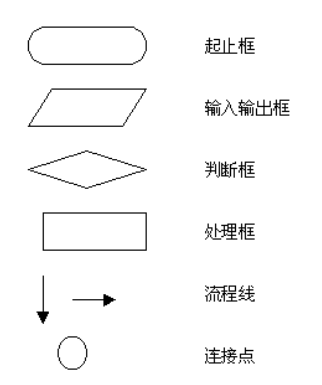
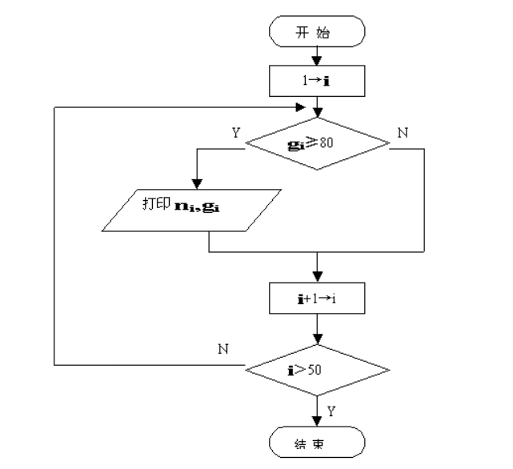
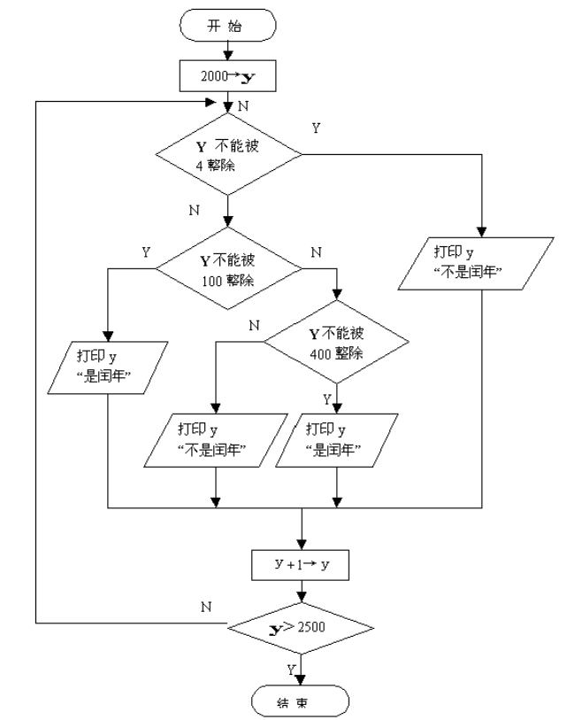
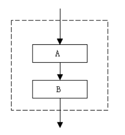
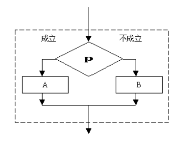
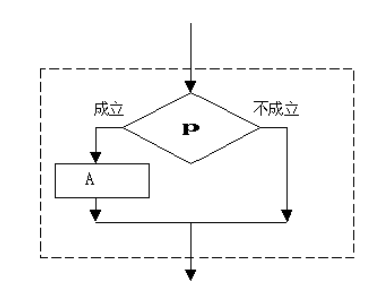
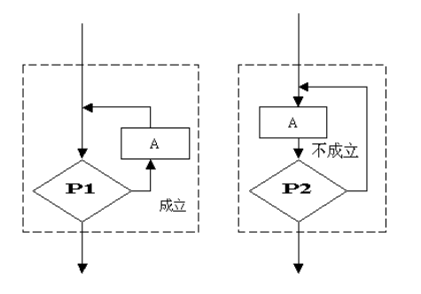
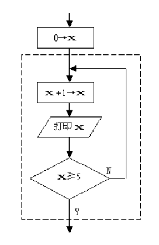

# 第2章 程序的灵魂——算法

一个程序应包括:

* 对数据的描述。在程序中要指定数据的类型和数据的组织形式，即数据结构(data structure)。
* 对操作的描述。即操作步骤，也就是算法(algorithm)。

本课程的目的是使同学知道怎样编写一个 JavaScript 程序，进行编写程序的初步训练，因此， 只介绍算法的初步知识。

## 2.1 算法的概念
做任何事情都有一定的步骤。为解决一个问题而采取的方法和步骤，就称为算法。

* 计算机算法:计算机能够执行的算法。
* 计算机算法可分为两大类:
	* 数值运算算法:求解数值;
	* 非数值运算算法:事务管理领域。

## 2.2 简单算法举例
【例 2.1】求 1×2×3×4×5。

最原始方法:

* 步骤 1:先求 1×2，得到结果 2。
* 步骤 2:将步骤 1 得到的乘积 2 乘以 3，得到结果 6。 
* 步骤3:将6再乘以4，得24。
* 步骤 4:将 24 再乘以 5，得 120。

这样的算法虽然正确，但太繁。

改进的算法:

* S1: 使 t=1
* S2: 使 i=2
* S3: 使 t×i, 乘积仍然放在在变量 t 中，可表示为 t×i→t
* S4: 使 i 的值+1，即 i+1→i
* S5: 如果 i≤5, 返回重新执行步骤 S3 以及其后的 S4 和 S5;否则，算法结束。

**如果计算 100!只需将 S5:若 i≤5 改成 i≤100 即可。**

如果该求 1×3×5×7×9×11，算法也只需做很少的改动:

* S1: 1→t
* S2: 3→i
* S3: t×i→t
* S4: i+2→t
* S5:若 i≤11, 返回 S3，否则，结束。

该算法不仅正确，而且是计算机较好的算法，因为计算机是高速运算的自动机器，实现循环 轻而易举。

>思考:若将 S5 写成:S5:若 i<11, 返回 S3;否则，结束。

【例 2.2】有 50 个学生，要求将他们之中成绩在 80 分以上者打印出来。

如果，n 表示学生学号，ni 表示第个学生学号;g 表示学生成绩，gi 表示第个学生成绩; 则算法可表示如下:

* S1: 1→i
* S2: 如果 gi≥80，则打印 ni 和 gi，否则不打印
* S3: i+1→i
* S4:若 i≤50, 返回 S2，否则，结束。

【例 2.3】判定 2000 — 2500 年中的每一年是否闰年，将结果输出。

>润年的条件:
>
>*  能被 4 整除，但不能被 100 整除的年份;
>* 能被 100 整除，又能被 400 整除的年份;

设 y 为被检测的年份，则算法可表示如下:

* S1: 2000→y
* S2:若 y 不能被 4 整除，则输出 y“不是闰年”，然后转到 S6
* S3:若 y 能被 4 整除，不能被 100 整除，则输出 y“是闰年”，然后转到 S6
* S4:若 y 能被 100 整除，又能被 400 整除，输出 y“是闰年” 否则输出 y“不是闰年”， 然后转到 S6
* S5:输出 y“不是闰年”。
* S6:y+1→y
* S7:当 y≤2500 时, 返回 S2 继续执行，否则，结束。

## 2.3 算法的特性

* 有穷性:一个算法应包含有限的操作步骤而不能是无限的。
* 确定性:算法中每一个步骤应当是确定的，而不能应当是含糊的、模棱两可的。
* 有零个或多个输入。
* 有一个或多个输出。
* 有效性:算法中每一个步骤应当能有效地执行，并得到确定的结果。 对于程序设计人员，必须会设计算法，并根据算法写出程序。

## 2.4 怎样表示一个算法

### 2.4.1 用自然语言表示算法
除了很简单的问题，一般不用自然语言表示算法。

### 2.4.2 用流程图表示算法

流程图表示算法，直观形象，易于理解。



【例 2.4】将例 2.1 求 5!的算用流程图表示。


【例 2.5】将例 2.2 的算用流程图表示。



【例 2.6】将例 2.3 判定闰年的算用流程图表示。



### 2.4.3 三种基本结构和改进的流程图

1，顺序结构:




2，选择结构:





3，循环结构





三种基本结构的共同特点:

* 只有一个入口;
* 只有一个出口;
* 结构内的每一部分都有机会被执行到;
* 结构内不存在“死循环”。

### 2.4.4 用计算机语言表示算法

* 我们的任务是用计算机解题，就是用计算机实现算法;
* 用计算机语言表示算法必须严格遵循所用语言的语法规则。

【例 2.7】求 1×2×3×4×5 用 JavaScript 语言表示。

```
let i;
let t;

t = 1;
i = 2;

while(i<=5){
	t = t*i;
	i = i+1;
}

console.log(t);
```
>同学们需要上机实践该代码

